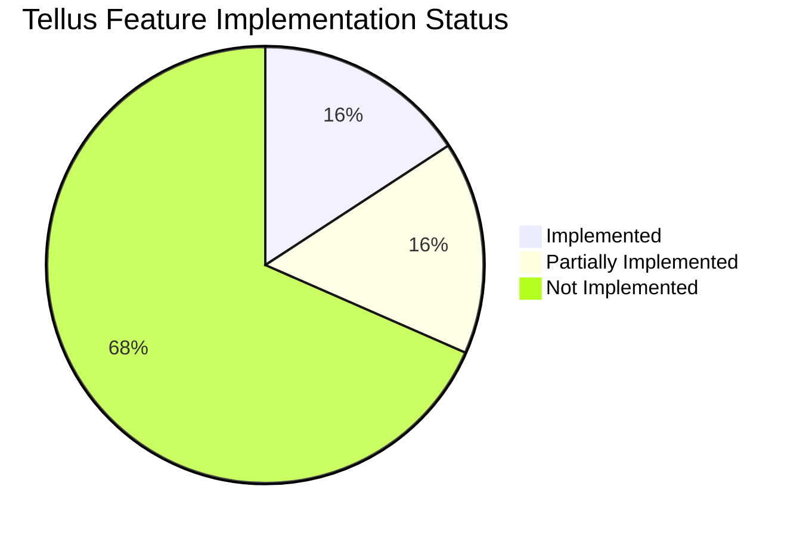

# Tellus — System Features and Gaps Analysis Report

This report evaluates the current codebase of **Tellus** against your list of job matching metrics, 19 product opportunities, and the overarching **Career Operating System** vision.

---

## 1. Job Match Scoring Evaluation
Your request highlights five key matching components. Here is how they compare to Tellus's current two-tier scoring system:

1. **Overall Score Calculation**:
   - **Manual Rescraped Jobs**: Computed server-side using LLMs in [runJobMatchingAgent](file:///c:/Users/AlvineOtieno/OneDrive%20-%20Pamela%20Steele%20Associates/Alvine%20Otieno/Hire/Dash/supabase/functions/_shared/job-agents.ts#L89) which evaluates candidate profiles against job contents.
   - **Marketplace Jobs**: Computed client-side in [computeJobMatch](file:///c:/Users/AlvineOtieno/OneDrive%20-%20Pamela%20Steele%20Associates/Alvine%20Otieno/Hire/Dash/src/lib/marketplace-profession-match.ts#L199) using weighted keyword token matching.

### Sub-Score Status Breakdown
| Matching Metric | Implementation Status | Technical Details & Code Reference |
| :--- | :--- | :--- |
| **Skills Match** | **Implemented** | Matching skills from the user profile are evaluated in [computeJobMatch](file:///c:/Users/AlvineOtieno/OneDrive%20-%20Pamela%20Steele%20Associates/Alvine%20Otieno/Hire/Dash/src/lib/marketplace-profession-match.ts#L236) (adds +15 on title hit, +10 on requirements, +5 on description). LLM matches skills server-side and lists matching details. |
| **Experience Level Match** | **Implemented** | Matches candidate experience level against job's extracted experience level in [computeJobMatch](file:///c:/Users/AlvineOtieno/OneDrive%20-%20Pamela%20Steele%20Associates/Alvine%20Otieno/Hire/Dash/src/lib/marketplace-profession-match.ts#L261) (adds +10 for matches). |
| **Industry / Role Match** | **Implemented** | Evaluates desired roles in user profile against job title and description with an active synonyms lookup table in [computeJobMatch](file:///c:/Users/AlvineOtieno/OneDrive%20-%20Pamela%20Steele%20Associates/Alvine%20Otieno/Hire/Dash/src/lib/marketplace-profession-match.ts#L214) (adds +35 on title match, +20 on description match). |
| **Salary Alignment** | **Missing** | User profile lists `minimum_salary` and job has `salary_text` (parsed by AI), but salary values are **never** compared to compute or affect the match score. |
| **Location Compatibility** | **Partially Implemented** | Compares user preferred county to job county in [computeJobMatch](file:///c:/Users/AlvineOtieno/OneDrive%20-%20Pamela%20Steele%20Associates/Alvine%20Otieno/Hire/Dash/src/lib/marketplace-profession-match.ts#L251) (adds +15). However, **remote compatibility** is not explicitly handled or scored. |

---

## 2. 19 Features & Opportunities Status

Below is the status of the 19 opportunities you outlined, detailing what exists and what does not.



### 1. Interview Preparation Intelligence
* **Status**: **Implemented**
* **Details**: 
  - Generates likely interview questions and suggested answers using the candidate's CV and job requirements in [runInterviewPrepAgent](file:///c:/Users/AlvineOtieno/OneDrive%20-%20Pamela%20Steele%20Associates/Alvine%20Otieno/Hire/Dash/supabase/functions/_shared/job-agents.ts#L407).
  - Renders Q&As in the [InterviewQuestionsSection](file:///c:/Users/AlvineOtieno/OneDrive%20-%20Pamela%20Steele%20Associates/Alvine%20Otieno/Hire/Dash/src/components/job-detail/interview-questions-section.tsx).
  - Houses a complete Chat and Voice Mock Interview system in the [InterviewModeLauncher](file:///c:/Users/AlvineOtieno/OneDrive%20-%20Pamela%20Steele%20Associates/Alvine%20Otieno/Hire/Dash/src/components/job-detail/interview-mode-launcher.tsx) powered by named recruiter AI agents in [interview-quiz.ts](file:///c:/Users/AlvineOtieno/OneDrive%20-%20Pamela%20Steele%20Associates/Alvine%20Otieno/Hire/Dash/supabase/functions/_shared/interview-quiz.ts).
  - Provides a weakness analysis, feedback score, and suggestions in the [InterviewReportSection](file:///c:/Users/AlvineOtieno/OneDrive%20-%20Pamela%20Steele%20Associates/Alvine%20Otieno/Hire/Dash/src/components/job-detail/interview-report-section.tsx).

### 2. Application Conversion Analytics
* **Status**: **Not Implemented**
* **Details**: The [dashboard.tsx](file:///c:/Users/AlvineOtieno/OneDrive%20-%20Pamela%20Steele%20Associates/Alvine%20Otieno/Hire/Dash/src/routes/_authenticated/dashboard.tsx) shows active bookmark/scraped job counts and match score distributions, but there are no dashboards showing application-to-interview rates, interview-to-offer rates, or CV version performance comparisons.

### 3. Salary Intelligence
* **Status**: **Not Implemented**
* **Details**: AI parses salary details from descriptions (e.g. `salary_text` in [scraped-job-analyst.ts](file:///c:/Users/AlvineOtieno/OneDrive%20-%20Pamela%20Steele%20Associates/Alvine%20Otieno/Hire/Dash/supabase/functions/_shared/scraped-job-analyst.ts#L32)) and uses them to fill recruiter expectation fields, but there is no AI benchmarking tool comparing salaries against role, experience, industry, or region.

### 4. Skills Gap Analysis
* **Status**: **Partially Implemented**
* **Details**: The matching agent computes job gaps (`match_gaps`) for each job detail view (see [job-detail-view.tsx:L353](file:///c:/Users/AlvineOtieno/OneDrive%20-%20Pamela%20Steele%20Associates/Alvine%20Otieno/Hire/Dash/src/components/job-detail/job-detail-view.tsx#L353)), but there is no dedicated skills gap page or learning roadmap generator.

### 5. Career Path Recommendation
* **Status**: **Not Implemented**
* **Details**: There is no career advising agent suggesting career transitions or next steps based on user background.

### 6. Networking Automation
* **Status**: **Not Implemented**
* **Details**: The system includes a referral program to upgrade accounts by inviting friends (e.g. [referral-limit-modal.tsx](file:///c:/Users/AlvineOtieno/OneDrive%20-%20Pamela%20Steele%20Associates/Alvine%20Otieno/Hire/Dash/src/components/referral-limit-modal.tsx)), but there is no automated outreach tool for LinkedIn, networking emails, or referral requests.

### 7. Personal Branding Optimization
* **Status**: **Not Implemented**
* **Details**: No AI auditor exists to review or score external branding assets like LinkedIn profiles, GitHub pages, or personal websites.

### 8. Application Quality Scoring
* **Status**: **Not Implemented**
* **Details**: The system generates the Application Pack (cover letter, email draft, tailored CV) in [application-preview-panel.tsx](file:///c:/Users/AlvineOtieno/OneDrive%20-%20Pamela%20Steele%20Associates/Alvine%20Otieno/Hire/Dash/src/components/job-detail/application-preview-panel.tsx) but does not evaluate or score the quality of those generated assets before submission.

### 9. ATS Compatibility Testing
* **Status**: **Not Implemented**
* **Details**: The system implements default parsing styles, but has no ATS compatibility checker, formatting evaluator, or keyword checklists.

### 10. Job Scam Detection
* **Status**: **Not Implemented**
* **Details**: Scam detection or risk scoring does not exist in the pipelines.

### 11. Interview Follow-Up Automation
* **Status**: **Not Implemented**
* **Details**: The system does not generate thank-you letters, follow-up messages, or keep trackers for post-interview check-ins.

### 12. Job Search Accountability Coach
* **Status**: **Partially Implemented**
* **Details**: A chat-based "Job Coach" in [job-coach.ts](file:///c:/Users/AlvineOtieno/OneDrive%20-%20Pamela%20Steele%20Associates/Alvine%20Otieno/Hire/Dash/supabase/functions/_shared/job-coach.ts) allows users to ask questions about specific jobs, their fit, and matching roles, but it is not an overall accountability coach setting goals or reminding users to maintain consistency.

### 13. Offer Evaluation Assistant
* **Status**: **Not Implemented**
* **Details**: No offer analyzer or negotiation assistant exists.

### 14. Relocation Intelligence
* **Status**: **Not Implemented**
* **Details**: Relocation statistics, visa steps, or international tax estimators are not implemented.

### 15. Recruiter Relationship CRM
* **Status**: **Not Implemented**
* **Details**: The [applications.tsx](file:///c:/Users/AlvineOtieno/OneDrive%20-%20Pamela%20Steele%20Associates/Alvine%20Otieno/Hire/Dash/src/routes/_authenticated/applications.tsx) list acts as a simple status dashboard for drafted packs, but there is no dedicated recruiter CRM to manage recruiter relationships, contact logs, or conversations.

### 16. AI-Powered Portfolio Builder
* **Status**: **Not Implemented**
* **Details**: The onboarding screen refers to "saving portfolios" to Drive, but it only saves CVs and cover letters. There is no website or project showcase generator.

### 17. Application Success Prediction
* **Status**: **Not Implemented**
* **Details**: There is no historical application learning model predicting low, medium, or high success rates.

### 18. Employer Intelligence
* **Status**: **Partially Implemented**
* **Details**: The job listing analyst extracts a basic [company_summary](file:///c:/Users/AlvineOtieno/OneDrive%20-%20Pamela%20Steele%20Associates/Alvine%20Otieno/Hire/Dash/supabase/functions/_shared/job-agents.ts#L24) during scraping, which lists size and sector in Kenya, but it doesn't aggregate reviews, cultural scores, layoff histories, or hiring speeds.

### 19. Hidden Job Discovery
* **Status**: **Implemented**
* **Details**: Implemented as **Career Site Monitors** in [monitors.tsx](file:///c:/Users/AlvineOtieno/OneDrive%20-%20Pamela%20Steele%20Associates/Alvine%20Otieno/Hire/Dash/src/routes/_authenticated/monitors.tsx). Users can add specific company career page URLs to check for vacancies on schedules (daily/weekly), scraping pages via Firecrawl/ScrapingBee to grab openings before they land on major job boards.

---

## 3. The Biggest Opportunity: Career Operating System (Analysis)
The current Tellus system operates primarily as a **Job Scraper, CV Tailor, and Interview practice tool**. It handles discrete points in the job-seeking process:

```
Ingest/Scrape (Marketplace/Monitors) ➔ Match (LLM/Client-side) ➔ Material Drafting (CV/Letter) ➔ Mock Interview Prep
```

### Key Gaps preventing a complete "Career Operating System":
1. **Lack of Horizontal Lifecycle Tracking**: Once a job is marked "applied", there is no CRM or calendar flow to track negotiations, offer stages, and follow-ups.
2. **Missing Long-Term Growth Tracking**: The platform does not help users improve their skills over time. It identifies matching gaps *per job*, but does not store aggregate gaps or offer learning roadmaps.
3. **No Multi-CV or Asset Versioning**: Only one CV is parsed and tailors are overwritten, making it impossible to analyze which resumes convert best.

### High-Priority Recommendations:
1. **Unify Scraped Jobs and Matching**: Run the server-side AI matcher on scraped jobs in the background (rather than client-side substring matching in the Marketplace) to surface accurate matches on the dashboard.
2. **Implement Application Analytics**: Add a simple pipeline dashboard to trace conversion rates (Draft ➔ Applied ➔ Interview ➔ Offer) across jobs.
3. **Introduce a Personal Skills Hub**: Aggregate the skills gaps identified across the user's matched jobs into a single list of missing skills, suggesting certifications and courses.
